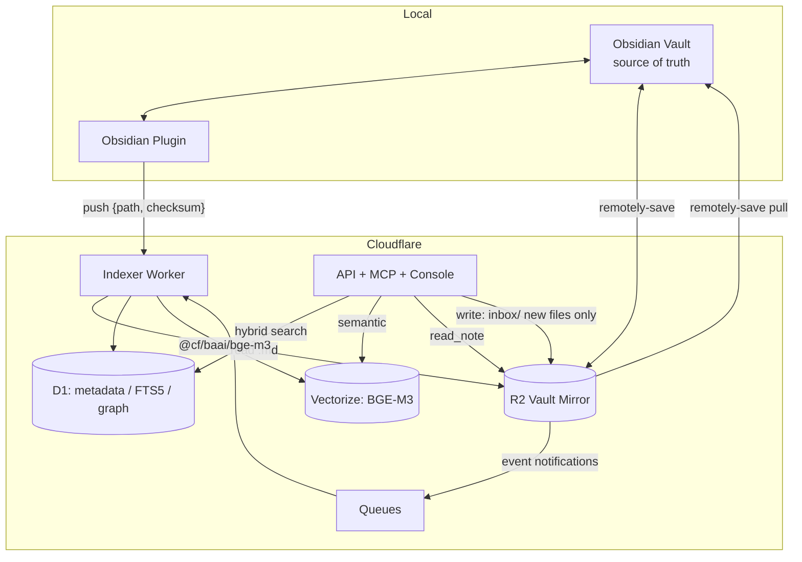

# FlareGraph

> Cloudflare-native LLM Wiki, Knowledge Graph, and Agentic Retreival system for Obsidian and Markdown vaults.
>  Cloudflare setup: [docs/deploy.md](docs/deploy.md)

[](https://deploy.workers.cloudflare.com/?url=https://github.com/ziwon/FlareGraph)

[](https://github.com/ziwon/FlareGraph/actions/workflows/ci.yml)
[](LICENSE)
[](https://workers.cloudflare.com/)
[](https://www.typescriptlang.org/)
[](https://pnpm.io/)
[](https://biomejs.dev/)
[](https://modelcontextprotocol.io/)

FlareGraph keeps an Obsidian vault as the single source of truth, mirrors it to R2, and layers D1 metadata, FTS5 search, BGE-M3 embeddings on Vectorize, an MCP server, and a wiki compiler on top.

## Architecture



```text
read path:   Vault → remotely-save → R2 → Indexer → D1 / Vectorize
             R2 → read_note (canonical markdown)
write path:  MCP/API capture → R2 inbox/ (new file) → remotely-save → Vault
edit path:   human/plugin → Vault → remotely-save → R2 → reindex
```

Core invariants: the server never modifies existing files (ADR-006), private notes are
filtered at the indexer stage (ADR-009), compiled `Wiki/` pages stay out of the embedding
index (ADR-008), and every derived store is rebuildable from the vault. Full design in
[docs/planning.md](docs/planning.md).

## Repository Layout

```text
apps/
  worker/    # Cloudflare Worker: API, MCP, Queue indexer, wiki compiler, search UI
    console/  # Static console UI served by the Worker
  plugin/    # Obsidian plugin: push triggers, inbox consolidation, status display
  cli/       # Local index/search CLI using node:sqlite and FTS5
packages/
  core/      # Markdown parser, heading-aware chunker, exclusions, wikilink resolver, wiki renderer
  db/        # Drizzle schema, migrations, and shared SQLite/D1 store logic
  contracts/ # API DTOs
  mcp/       # MCP tool definitions split into read, write, and experimental groups
```

## Quick Start

```bash
pnpm install
pnpm -r build

node apps/cli/dist/main.js index ~/Obsidian/MainVault
node apps/cli/dist/main.js search "RDMA"
node apps/cli/dist/main.js links "RDMA"
node apps/cli/dist/main.js graph neighbors "RDMA" --hops 2
node apps/cli/dist/main.js errors list
```

Privacy exclusions are handled before indexing. Add `private: true` to frontmatter, or create `.flaregraph/settings.json` in the vault:

```json
{
  "exclude_folders": ["Private"]
}
```

Excluded files are not written to the index.

## Cloudflare Setup

The Worker exposes the search UI, API routes, indexing hooks, wiki compiler, graph extraction endpoint, and MCP server.

```text
GET  /                      # Search UI
GET  /api/health            # Page count and last index timestamp
GET  /api/search?q=...&mode=hybrid|keyword|semantic|graph
GET  /api/pages
GET  /api/pages/:id
GET  /api/notes/<path>
GET  /api/graph/neighbors/:id
POST /api/capture           # Inbox/new-file capture endpoint
POST /api/index/push        # Obsidian plugin push: {path, checksum}
POST /api/index/rebuild     # Full reindex from the R2 mirror
POST /api/wiki/compile      # {topic} -> new wiki page
POST /api/graph/extract     # {path} -> evidence-backed claim/relation extraction
POST /mcp                   # MCP server: search_notes, read_note, follow_links, ...
```

Authentication is expected through Cloudflare Access email one-time PIN or `Authorization: Bearer <API_TOKEN>`.

See [docs/deploy.md](docs/deploy.md) for resource setup, R2 mirroring, queue wiring, secrets, and remaining manual steps. The button above uses Cloudflare's Workers deploy button flow and requires a public GitHub or GitLab repository.

## Obsidian Sync

FlareGraph does not integrate directly with Obsidian Sync because the official sync protocol is private. Instead, it uses the `remotely-save` Obsidian plugin with R2 through the S3 API.

In this model, R2 is the cloud source layer. Notes written on mobile can sync to R2, trigger Queue events, and be indexed without a desktop client running. See the `remotely-save` section in [docs/deploy.md](docs/deploy.md).

## MCP Connection

```bash
claude mcp add flaregraph --transport http https://<your-worker-host>/mcp \
  --header "Authorization: Bearer <API_TOKEN>"
```

## Development

```bash
just build
just test
just typecheck
just dev-worker
just deploy
```

Quality gates: `pnpm lint` (Biome), `pnpm e2e` (Playwright console smoke tests),
and `pre-commit install` for the local hook (Biome + workspace typecheck).
CI runs lint/build/typecheck/test/e2e on every push and PR; deploys are manual
via the *Deploy* workflow (`CLOUDFLARE_API_TOKEN` repository secret required).
