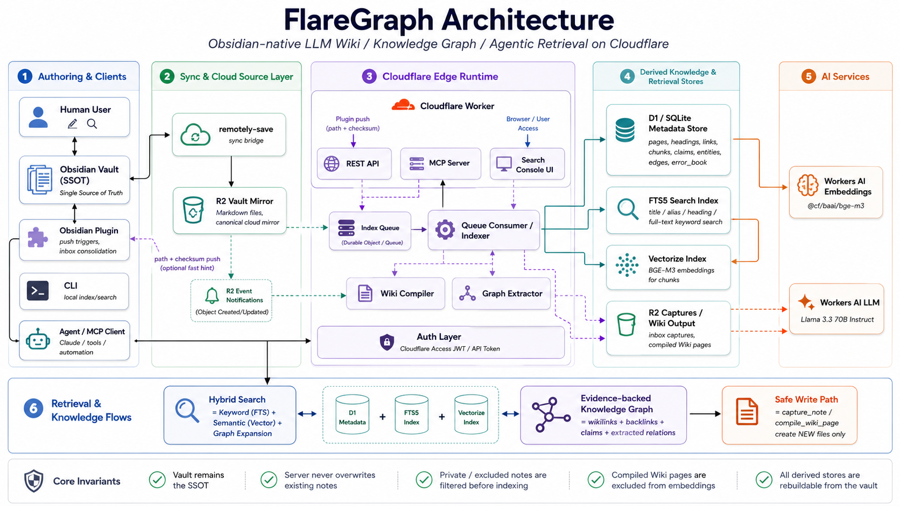

# FlareGraph Architecture

> Obsidian-native LLM Wiki / Knowledge Graph / Agentic Retrieval on Cloudflare



The diagram is organized into five vertical areas plus two horizontal bands
(retrieval flows and core invariants). This document walks through each area and
maps it to the code.

## 1. Authoring & Clients

| Component | Role | Code |
|---|---|---|
| Human user | Writes and edits notes in Obsidian — never through FlareGraph | — |
| Obsidian Vault (SSOT) | The single source of truth; plain Markdown on disk | — |
| Obsidian plugin | Instant index triggers (`{path, checksum}` only, never bodies), inbox consolidation, status bar | `apps/plugin/` |
| CLI | Local indexing and FTS search without any cloud dependency (MVP 0), plus vault↔cloud verification | `apps/cli/` |
| Agent / MCP client | Claude, tools, automations — consume the vault through MCP or REST | — |

Humans author locally; agents read remotely. FlareGraph never becomes the
writing surface.

## 2. Sync & Cloud Source Layer

| Component | Role | Code |
|---|---|---|
| remotely-save | Third-party Obsidian plugin syncing Vault ↔ R2 over the S3 API. FlareGraph deliberately does not implement its own sync | external |
| R2 Vault Mirror | Canonical `.md` files in the cloud — the read layer for every server-side component (ADR-005) | bucket `flaregraph-vault` |
| R2 Event Notifications | Object create/delete events fan into the index queue, so mobile-only edits still get indexed | `docs/deploy.md` §3 |

The mirror is derived data: lose it and a local re-sync rebuilds it; lose D1 or
Vectorize and `POST /api/index/rebuild` restores them from the mirror.

## 3. Cloudflare Edge Runtime

One Worker (`apps/worker/`) hosts every runtime surface:

| Surface | Role | Code |
|---|---|---|
| REST API | Search, pages, notes, capture, rebuild, compile, extract | `src/routes/api.ts` |
| MCP Server | `search_notes`, `read_note`, `list_links`, `follow_links`, `expand_neighbors`, `find_claims` (read) + `capture_note`, `compile_wiki_page` (opt-in write) | `src/mcp/server.ts` |
| Search Console UI | Static single-page console served from Worker assets | `console/` |
| Index Queue + Consumer | R2 events and plugin pushes are consumed in batches: checksum-gated indexing, rename detection, delayed vector GC | `src/indexer/index.ts` |
| Wiki Compiler | Compiles topic pages from raw notes; writes new revisions only | `src/compiler.ts` |
| Graph Extractor | LLM claim/relation extraction — every stored edge requires a source span | `src/compiler.ts` (`extractGraph`) |
| Auth Layer | Cloudflare Access JWT (email OTP / service tokens) or Bearer token; fails closed | `src/auth.ts` |

## 4. Derived Knowledge & Retrieval Stores

| Store | Contents | Notes |
|---|---|---|
| D1 / SQLite | `pages`, `headings`, `links`, `chunks`, `claims`, `entities`, `edges`, `vector_refs`, `captures`, `error_book`, `compiler_rules` | No note bodies — metadata only (`packages/db/`) |
| FTS5 index | `chunks_fts` shadow table: title/alias/heading + full-text keyword search (ADR-007) | Rebuilt with every reindex; covers the proper-noun/code-symbol axis where dense embeddings are weak |
| Vectorize index | BGE-M3 chunk embeddings (1024-dim, cosine), content-addressed ids `chunk:{page_id}:{hash}` | Insert + stale GC, never upsert-in-place (ADR-010); `Wiki/` is excluded (ADR-008) |
| R2 captures / wiki output | `inbox/` captures and compiled `Wiki/` pages — new files only | The only server write path (ADR-006) |

## 5. AI Services

| Service | Use |
|---|---|
| Workers AI `@cf/baai/bge-m3` | Chunk + query embeddings for semantic search |
| Workers AI Llama 3.3 70B Instruct | Wiki compilation, claim/relation extraction, error-book distillation |

Both are swappable via `EMBEDDING_MODEL` / `LLM_MODEL` vars. Note bodies are sent
only per-request for compilation/extraction — never bulk-exported.

## 6. Retrieval & Knowledge Flows

```text
Hybrid search  = keyword (FTS5) + semantic (Vectorize) + graph expansion,
                 merged and reranked: exact title > alias > FTS > semantic,
                 raw notes above compiled pages unless include_compiled=true
Knowledge graph = deterministic edges (wikilinks/backlinks/tags) first;
                 LLM-extracted claims/relations carry mandatory evidence spans
Safe write path = capture_note / compile_wiki_page create NEW files only
```

Data flow summary:

```text
read path:   Vault → remotely-save → R2 → Queue → Indexer → D1 / FTS5 / Vectorize
             R2 → read_note (canonical markdown, index-gated)
write path:  MCP/API capture → R2 inbox/ (new file) → remotely-save → Vault
edit path:   human/plugin → Vault → remotely-save → R2 → reindex
```

## Core Invariants

1. **Vault remains the SSOT** — every cloud store is derived and rebuildable.
2. **The server never overwrites existing notes** — writes are new files in
   `inbox/` and `Wiki/` (revisions), which makes sync conflicts structurally
   impossible (ADR-006).
3. **Private / excluded notes are filtered before indexing** (ADR-009) — they
   never reach D1, Vectorize, or LLM calls, and note reads are gated on the
   index, so a mirrored-but-excluded file is not readable through the API/MCP.
4. **Compiled Wiki pages are excluded from embeddings** (ADR-008) — no
   self-reference loop polluting search.
5. **All derived stores are rebuildable from the vault** — deleting D1,
   Vectorize, or even the R2 mirror is recoverable.

## Design decisions

The full ADR list (ADR-001…010) with alternatives considered lives in the
original planning document. The ones that shape this diagram most:

- **ADR-005** — the R2 mirror is the cloud read layer (not a D1 body cache).
- **ADR-006** — server writes are restricted to new `inbox/` files.
- **ADR-007** — body keyword search is a rebuildable FTS5 shadow table.
- **ADR-008** — compiled pages get a separate search tier and no embeddings.
- **ADR-009** — privacy exclusion happens at the indexer, the earliest stage.
- **ADR-010** — rename/delete use explicit `vector_refs`-based GC because chunk
  ids are content-addressed and Vectorize has no prefix delete.
